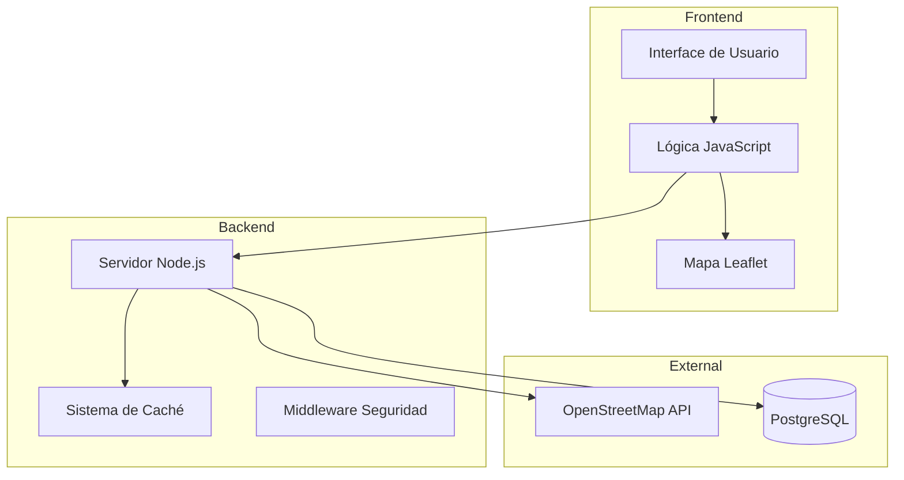

# Buscador de Monumentos 🏛️


## 📑 Índice
1. [Descripción del Proyecto](#descripción-del-proyecto)
2. [Estructura y Arquitectura](#estructura-y-arquitectura)
3. [Tecnologías Utilizadas](#tecnologías-utilizadas)
4. [Guía de Instalación](#guía-de-instalación)
5. [Desarrollo del Proyecto](#desarrollo-del-proyecto)
6. [Documentación Técnica](#documentación-técnica)
7. [Guía de Usuario](#guía-de-usuario)
8. [Mejoras Futuras](#mejoras-futuras)
9. [Licencia](#licencia)

## Descripción del Proyecto

El Buscador de Monumentos es una aplicación web que permite a los usuarios explorar y descubrir monumentos históricos. La aplicación combina una interfaz intuitiva con mapas interactivos, permitiendo buscar y visualizar información detallada sobre diferentes monumentos y lugares históricos.

### Características Principales

#### Sistema de Búsqueda
- Búsqueda en tiempo real con actualización instantánea
- Filtrado inteligente por relevancia y proximidad
- Sugerencias basadas en el historial de búsquedas

#### Visualización de Mapas
- Integración con Leaflet.js para mapas interactivos
- Marcadores personalizados para diferentes tipos de monumentos
- Sistema de agrupación de marcadores cercanos

#### Gestión de Datos
- Sistema de caché para optimizar tiempos de respuesta
- Almacenamiento en PostgreSQL
- Sincronización con OpenStreetMap

## Estructura y Arquitectura

### Diagrama de la Aplicación



### Estructura de Carpetas

```
monument-search/
├── src/
│   ├── config/          # Configuración
│   ├── middleware/      # Middlewares
│   ├── models/          # Modelos de datos
│   ├── services/        # Servicios
│   └── server.js        # Servidor principal
├── public/
│   ├── css/            # Estilos
│   ├── js/             # Scripts cliente
│   └── images/         # Recursos
└── docker/             # Configuración Docker
```

## Tecnologías Utilizadas

### Frontend
- HTML5
- CSS3 (Flexbox, Grid, Animaciones)
- JavaScript ES6+
- Leaflet.js para mapas

### Backend
- Node.js
- PostgreSQL
- Docker
- Winston para logging

## Guía de Instalación

### Prerrequisitos
- Node.js (v14 o superior)
- Docker y Docker Compose
- Git

### Pasos de Instalación

1. **Clonar el repositorio**
```bash
git clone https://github.com/usuario/monument-search.git
cd monument-search
```

2. **Configurar variables de entorno**
```bash
cp .env.example .env
```

3. **Instalar dependencias**
```bash
npm install
```

4. **Iniciar con Docker**
```bash
docker-compose up -d
```

## Desarrollo del Proyecto

# Desarrollo del Proyecto: Retos y Soluciones

## Evolución y Desafíos Principales

### 1. Integración del Mapa y Marcadores

#### Desafío Inicial
Los marcadores del mapa no se visualizaban correctamente después de realizar una búsqueda y la interacción con el mapa era deficiente.

#### Análisis del Problema
- Los assets de Leaflet no se cargaban correctamente
- Las rutas de los archivos estaban mal configuradas
- Los marcadores se creaban pero no eran visibles

#### Solución Implementada
```javascript
class MapHandler {
    constructor() {
        this.map = null;
        this.markers = [];
        this.defaultIcon = L.icon({
            iconUrl: 'https://unpkg.com/leaflet@1.9.4/dist/images/marker-icon.png',
            iconRetinaUrl: 'https://unpkg.com/leaflet@1.9.4/dist/images/marker-icon-2x.png',
            shadowUrl: 'https://unpkg.com/leaflet@1.9.4/dist/images/marker-shadow.png',
            iconSize: [25, 41],
            iconAnchor: [12, 41],
            popupAnchor: [1, -34],
            shadowSize: [41, 41]
        });
        this.initMap();
    }

    addMarker(monument) {
        if (!monument || !monument.latitude || !monument.longitude) {
            console.warn('Datos de monumento inválidos:', monument);
            return;
        }

        const marker = L.marker([monument.latitude, monument.longitude], {
            icon: this.defaultIcon
        });
        
        marker.addTo(this.map);
        this.markers.push(marker);
    }
}
```

### 2. Gestión de Rutas y Archivos Estáticos

#### Desafío Inicial
Problemas con el servidor para servir archivos estáticos y manejar diferentes rutas correctamente.

#### Análisis del Problema
- Las rutas no se resolvían correctamente
- Tipos MIME incorrectos
- Problemas con rutas relativas

#### Solución Implementada
```javascript
async function handleStaticFiles(req, res, pathname) {
    try {
        let filePath;
        if (pathname === '/') {
            filePath = path.join(__dirname, '../public/index.html');
        } else {
            filePath = path.join(__dirname, '../public', pathname);
        }

        const content = await fs.readFile(filePath);
        const ext = path.extname(filePath);
        const contentType = getContentType(ext);

        res.writeHead(200, { 'Content-Type': contentType });
        res.end(content);
    } catch (error) {
        if (error.code === 'ENOENT') {
            res.writeHead(404);
            res.end('File not found');
        } else {
            res.writeHead(500);
            res.end('Internal server error');
        }
    }
}

function getContentType(ext) {
    const types = {
        '.html': 'text/html',
        '.css': 'text/css',
        '.js': 'text/javascript',
        '.png': 'image/png',
        '.jpg': 'image/jpeg'
    };
    return types[ext] || 'text/plain';
}
```

### 3. Optimización de Rendimiento

#### Desafío Inicial
Tiempos de respuesta lentos y consumo excesivo de recursos en búsquedas repetidas.

#### Análisis del Problema
- Llamadas repetidas a la API de OpenStreetMap
- Sin sistema de caché
- Respuestas lentas en búsquedas frecuentes

#### Solución Implementada
```javascript
class CacheManager {
    constructor() {
        this.cache = new Map();
        this.maxAge = 3600000; // 1 hora
    }

    async get(key) {
        const cached = this.cache.get(key);
        if (cached) {
            if (Date.now() - cached.timestamp < this.maxAge) {
                return cached.data;
            } else {
                this.cache.delete(key);
            }
        }
        return null;
    }

    set(key, data) {
        this.cache.set(key, {
            data,
            timestamp: Date.now()
        });
    }

    cleanup() {
        const now = Date.now();
        for (const [key, value] of this.cache.entries()) {
            if (now - value.timestamp > this.maxAge) {
                this.cache.delete(key);
            }
        }
    }
}
```

### 4. Seguridad y Rate Limiting

#### Desafío Inicial
Vulnerabilidades potenciales y necesidad de controlar el acceso a la API.

#### Análisis del Problema
- Sin control de acceso
- Vulnerabilidades XSS potenciales
- Necesidad de limitar peticiones

#### Solución Implementada
```javascript
// Middleware de Rate Limiting
class RateLimiter {
    constructor() {
        this.requests = new Map();
        this.windowMs = 15 * 60 * 1000; // 15 minutos
        this.maxRequests = 100;
    }

    checkLimit(clientIP) {
        const now = Date.now();
        const windowStart = now - this.windowMs;
        const requestTimestamps = this.requests.get(clientIP) || [];
        const requestsInWindow = requestTimestamps.filter(ts => ts > windowStart);

        if (requestsInWindow.length >= this.maxRequests) {
            return false;
        }

        requestsInWindow.push(now);
        this.requests.set(clientIP, requestsInWindow);
        return true;
    }
}

// Headers de Seguridad
function applySecurityHeaders(res) {
    const headers = {
        'Strict-Transport-Security': 'max-age=31536000',
        'X-Content-Type-Options': 'nosniff',
        'X-Frame-Options': 'DENY',
        'X-XSS-Protection': '1; mode=block',
        'Content-Security-Policy': "default-src 'self'"
    };

    Object.entries(headers).forEach(([key, value]) => {
        res.setHeader(key, value);
    });
}
```

### 5. Organización del Código y Estructura

#### Desafío Inicial
Necesidad de mejorar la organización del código y la mantenibilidad.

#### Análisis del Problema
- Código mezclado y poco organizado
- Dificultad para mantener y escalar
- Falta de estándares claros

#### Solución Implementada
- Reorganización en estructura modular
- Implementación de servicios separados
- Sistema de logging centralizado
```javascript
// Ejemplo de organización en servicios
class MonumentService {
    constructor(osmService, cacheManager) {
        this.osmService = osmService;
        this.cache = cacheManager;
    }

    async searchMonuments(query) {
        // Intentar obtener de caché
        const cached = await this.cache.get(query);
        if (cached) return cached;

        // Buscar en OSM
        const results = await this.osmService.search(query);
        
        // Guardar en caché
        await this.cache.set(query, results);
        
        return results;
    }
}
```

## Documentación Técnica

### API Endpoints

#### GET /api/search
Busca monumentos según el término proporcionado.

**Parámetros**:
- `query` (string): Término de búsqueda

**Respuesta**:
```json
{
    "results": [
        {
            "title": "Sagrada Familia",
            "location": {
                "lat": 41.4036,
                "lon": 2.1744
            }
        }
    ]
}
```

## Guía de Usuario

### Búsqueda de Monumentos
1. Introducir término de búsqueda
2. Seleccionar resultados en el mapa
3. Ver información detallada

### Navegación del Mapa
- Zoom con rueda del ratón
- Arrastrar para moverse
- Click en marcadores

## Mejoras Futuras

### Funcionalidades Planificadas
1. Sistema de usuarios y favoritos
2. Filtros avanzados de búsqueda
3. Rutas entre monumentos
4. Modo offline (PWA)

Este proyecto es solo el inicio de la versión final que quiero crear, la cual incluirá IA para reconocimiento de fotos en vez de búsquedas manuales.
La versión final también incluirá una interfaz de usuario más atractiva y nuevas funcionalidades. 

## Licencia

Este proyecto está bajo la Licencia MIT. Ver archivo `LICENSE` para más detalles.

---
Desarrollado por Josu Elvira Ojer